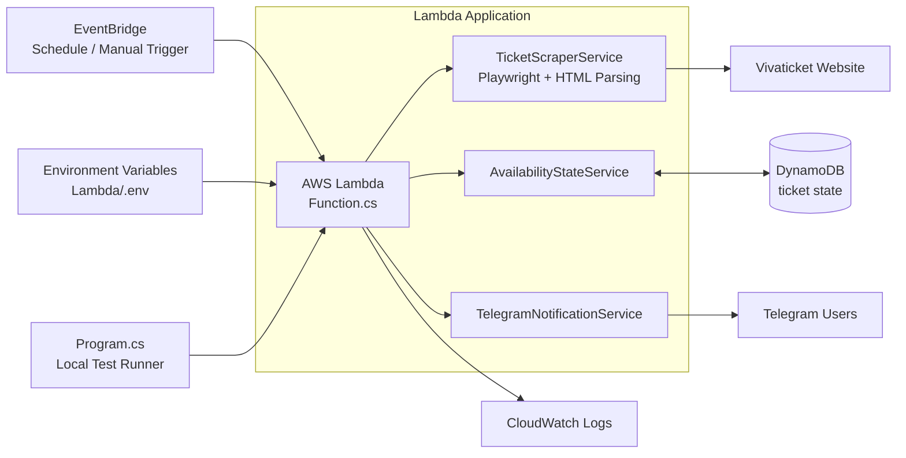
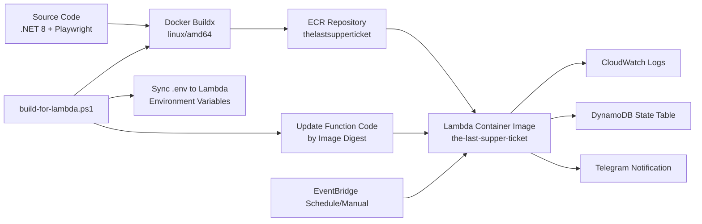

# The Last Supper Ticket - AWS Lambda (.NET 8 + Playwright)

## Project Purpose

This project is built to monitor "The Last Supper" ticket pages and proactively send Telegram notifications when newly released ticket dates appear.
The goal is to help interested visitors get alerted quickly and improve their chance of purchasing tickets in time.

## Telegram Notification Channel
Welcome everyone interested in getting official tickets legally at official prices, rather than paying for expensive package tours.

Channel link: [Join the Telegram channel](https://t.me/+uNY3knlZy0NkODc1)

## Scope Disclaimer

This project is notification-only.
It does not perform ticket sniping, seat holding, account automation, checkout automation, or any auto-purchase flow.

This project has been verified to run on AWS Lambda (Container Image) and successfully scrape available dates from the Vivaticket page.

> Playwright on Lambda must be deployed as a container (`PackageType: Image`), not as a zip package.

## Verified Environment

- Runtime: .NET 8
- Lambda architecture: `x86_64`
- Container base image: `public.ecr.aws/lambda/dotnet:8`
- Browser engine: Playwright Chromium

## Prerequisites

- Docker Desktop (with Buildx)
- .NET 8 SDK
- AWS CLI v2 (already configured with `aws configure`)
- Permissions: ECR / Lambda / CloudFormation / IAM / CloudWatch Logs

## Project Structure

```
thelastsupperticket/
├── Function.cs
├── Program.cs
├── Dockerfile
├── serverless.yaml
├── Services/
│   ├── TicketScraperService.cs
│   ├── AvailabilityStateService.cs
│   └── TelegramNotificationService.cs
└── thelastsupperticket.csproj
```

## System Architecture Diagram

This diagram shows how one Lambda execution interacts with the ticket website, DynamoDB state storage, Telegram notifications, and CloudWatch logs.
You can also run the same main flow locally through `Program.cs`.



## Deployment Flow Diagram

This diagram shows the full deployment path from source code to container build, ECR push, Lambda update, runtime trigger, and outputs.
`build-for-lambda.ps1` orchestrates build, environment-variable sync, and digest-based Lambda update.



## Environment Variables

Configure the following environment variables in Lambda Function settings (you can use `.env` locally):

- `TARGET_CONFIGS`: Ticket target config list (`ticketType|url`, separated by `;`)
- `TARGET_URLS`: Ticket page URL list (comma-separated, backward-compatible fallback)
- `TARGET_URL`: Single ticket page URL (backward-compatible fallback when `TARGET_URLS` is not set)
- `TELEGRAM_BOT_TOKEN`: Telegram bot token (for notifications)
- `TELEGRAM_USER_IDS`: Recipient IDs (comma-separated)
- `TELEGRAM_ENABLED`: `true` / `false`
- `NOTIFY_TARGET_DATES`: Optional target dates filter for notifications (comma-separated, format: `dd/MM/yyyy`), e.g. `09/04/2026,10/04/2026`
- `DYNAMODB_STATE_TABLE`: DynamoDB table name used to store previous available dates

Example:

```dotenv
TARGET_CONFIGS=Ticket only|https://cenacolovinciano.vivaticket.it/en/event/cenacolo-vinciano/151991;Ticket + English guided tour|https://cenacolovinciano.vivaticket.it/en/event/cenacolo-visite-guidate-a-orario-fisso-in-inglese/238363
```

> If `TELEGRAM_ENABLED=true` but `TELEGRAM_BOT_TOKEN` is missing, scraping still runs, but notification failures will appear in logs.
> If `NOTIFY_TARGET_DATES` is empty or not set, notification logic remains unchanged (notify on any new available date).
> If `NOTIFY_TARGET_DATES` is set, only matching target dates trigger new-date Telegram notifications.

Notification deduplication state (previous available dates) is now stored in DynamoDB; Telegram messages are sent only when new dates appear.

## Docker + ECR Deployment (Recommended)

The following flow is currently verified in practice.

```bash
# 1) Parameters
ACCOUNT_ID=<your-account-id>
REGION=<your-region>
REPO=thelastsupperticket
IMAGE_URI=$ACCOUNT_ID.dkr.ecr.$REGION.amazonaws.com/$REPO

# 2) Create ECR repository (first time only)
aws ecr create-repository --repository-name $REPO --region $REGION

# 3) Login to ECR
aws ecr get-login-password --region $REGION | docker login --username AWS --password-stdin $ACCOUNT_ID.dkr.ecr.$REGION.amazonaws.com

# 4) Build and push single-architecture image (Lambda compatible)
#    Important: always set --platform linux/amd64 and disable provenance/sbom
docker buildx build --platform linux/amd64 --provenance=false --sbom=false \
  -t $IMAGE_URI:latest \
  --push .

# 5) Validate manifest media type (must not be oci.image.index)
aws ecr batch-get-image --repository-name $REPO --image-ids imageTag=latest --region $REGION --query "images[0].imageManifestMediaType" --output text
```

Expected manifest media type:

- `application/vnd.docker.distribution.manifest.v2+json`, or
- `application/vnd.oci.image.manifest.v1+json`

## One-Command Deployment Script (PowerShell)

The script [build-for-lambda.ps1](build-for-lambda.ps1) performs buildx push, digest-based Lambda update, `.env` sync to Lambda environment variables, waits for function update, and runs a smoke test.

```powershell
# Use default parameters (ap-northeast-1 / thelastsupperticket / the-last-supper-ticket)
pwsh .\build-for-lambda.ps1

# Deploy CloudFormation stack first (apply serverless.yaml changes such as schedule), then update Lambda image
pwsh .\build-for-lambda.ps1 -DeployStack

# Deploy CloudFormation stack only (apply serverless.yaml changes only)
pwsh .\build-for-lambda.ps1 -DeployStackOnly

# Specify stack name/template when deploying stack
pwsh .\build-for-lambda.ps1 -DeployStack -StackName TheLastSupperTicket-Stack -TemplateFilePath .\serverless.yaml

# Specify region
pwsh .\build-for-lambda.ps1 -Region ap-northeast-1

# Update Lambda only (skip invoke test)
pwsh .\build-for-lambda.ps1 -SkipInvoke

# Specify .env path
pwsh .\build-for-lambda.ps1 -EnvFilePath .\.env

# Skip .env sync
pwsh .\build-for-lambda.ps1 -SkipEnvSync

# Use registry-based Buildx cache (enabled by default, cache tag configurable)
pwsh .\build-for-lambda.ps1 -BuildCacheTag buildcache

# Disable Buildx cache explicitly
pwsh .\build-for-lambda.ps1 -DisableBuildCache

# Customize ECR lifecycle retention (default: tagged=5, buildcache=2, untagged expire after 3 days)
pwsh .\build-for-lambda.ps1 -KeepTaggedImageCount 5 -KeepBuildCacheImageCount 2 -ExpireUntaggedAfterDays 3

# Skip applying ECR lifecycle policy
pwsh .\build-for-lambda.ps1 -SkipEcrLifecyclePolicy
```

> `.env` sync uses merge mode: it reads existing Lambda variables first, then overwrites keys that also exist in `.env`, without clearing unrelated existing keys.
> If you changed `serverless.yaml` resources (for example EventBridge schedule), include `-DeployStack` so CloudFormation applies those infrastructure changes.
> Use `-DeployStackOnly` when you only need infrastructure/template updates and do not want to rebuild or redeploy Lambda image code.
> Build cache is enabled by default via registry cache (`<image>:buildcache`) to speed up repeated `docker buildx build` runs.
> ECR lifecycle policy is also applied by default to control storage growth (retain newest tagged and cache images; auto-expire stale untagged images).

## CloudFormation / SAM Deployment

This project uses [serverless.yaml](serverless.yaml) as the template.

```bash
aws cloudformation deploy \
  --template-file serverless.yaml \
  --stack-name TheLastSupperTicket-Stack \
  --capabilities CAPABILITY_IAM \
  --region <your-region>
```

> If you deploy directly through CloudFormation/SAM, `Environment.Variables` in `serverless.yaml` may overwrite existing Lambda variables. Recommended: run `build-for-lambda.ps1` after deployment (without `-SkipEnvSync`) to sync `.env`.

## Important: How to Ensure Lambda Uses the New Image

If the template still points to the same `:latest` tag, CloudFormation may show `No changes to deploy`.

### Option A (Recommended): Use a New Tag Every Time

```bash
TAG=$(date +%Y%m%d-%H%M%S)
docker buildx build --platform linux/amd64 --provenance=false --sbom=false -t $IMAGE_URI:$TAG --push .
# Then update ImageUri in serverless.yaml to :$TAG and deploy
```

### Option B: Update Lambda by Image Digest

```bash
DIGEST=$(aws ecr describe-images --repository-name $REPO --region $REGION --query "sort_by(imageDetails,& imagePushedAt)[-1].imageDigest" --output text)
aws lambda update-function-code --function-name the-last-supper-ticket --image-uri $IMAGE_URI@$DIGEST --region $REGION
aws lambda wait function-updated --function-name the-last-supper-ticket --region $REGION
```

## Deployment Verification

```bash
# Invoke Lambda
aws lambda invoke \
  --function-name the-last-supper-ticket \
  --region <your-region> \
  --cli-binary-format raw-in-base64-out \
  --payload '{}' \
  response.json

# View response
cat response.json

# View logs from the last 5 minutes
aws logs tail /aws/lambda/the-last-supper-ticket --since 5m --region <your-region>
```

### Manual Trigger (EventBridge)

A manual trigger rule is already configured (`source=thelastsupperticket.manual`, `detail-type=RunNow`). You can trigger it anytime with:

**Bash (macOS / Linux / Git Bash)**

```bash
aws events put-events \
  --region <your-region> \
  --entries '[{"Source":"thelastsupperticket.manual","DetailType":"RunNow","Detail":"{}"}]'
```

**PowerShell (Windows)**

```powershell
Set-Content -Path .\manual-event.json -Encoding ascii -Value '[{"Source":"thelastsupperticket.manual","DetailType":"RunNow","Detail":"{}"}]'
aws events put-events --region <your-region> --entries file://manual-event.json
Remove-Item .\manual-event.json -ErrorAction SilentlyContinue
```

A successful response looks like:

```json
{
  "StatusCode": 200,
  "Message": "Found available ticket dates",
  "HasAvailableDates": true,
  "AvailableDates": ["13 March", "15 March"]
}
```

## Run Locally

```bash
dotnet build
dotnet run
```

You can use `.env` locally, but when deployed to Lambda, the same keys must exist in Lambda environment variables.

## FAQ

### 1) CloudFormation Error: Unsupported Image Media Type

Error message: `The image manifest, config or layer media type ... is not supported`

Cause: image was pushed as a multi-arch OCI index.  
Fix:

```bash
docker buildx build --platform linux/amd64 --provenance=false --sbom=false --push ...
```

### 2) Lambda Startup Failure: `/var/task` Not Found

Cause: container output path/handler configuration is incorrect.  
Fix: use the corrected `Dockerfile` in this project.

### 3) Playwright Cannot Find Browser or Chromium Crashes

Cause: browser path/version mismatch, permissions, or missing runtime libraries.  
Fix: use the corrected `Dockerfile` + `TicketScraperService.cs` in this project (already includes working configuration).

### 4) Telegram Notification Failure

Common message: `Telegram Bot Token cannot be empty`  
Fix: set `TELEGRAM_BOT_TOKEN`, or set `TELEGRAM_ENABLED=false`.

## License

MIT
